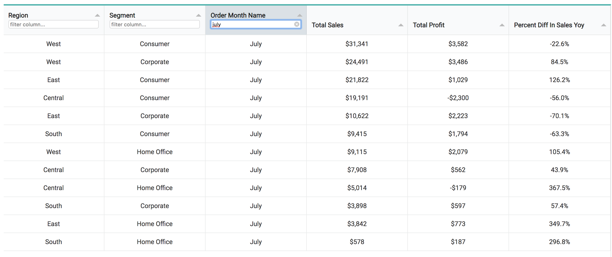
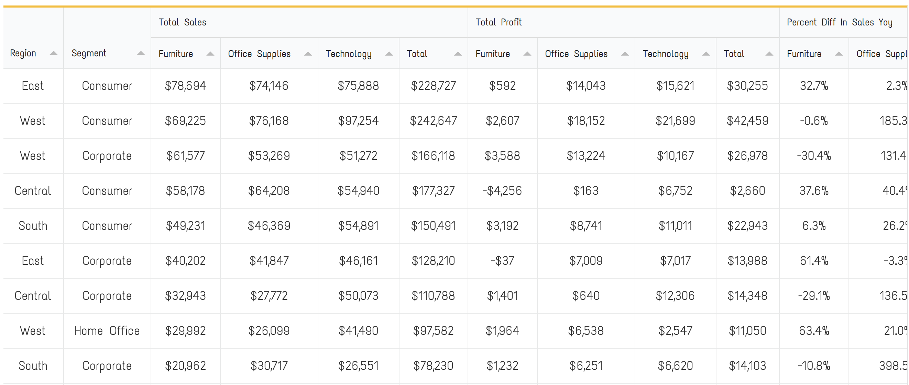
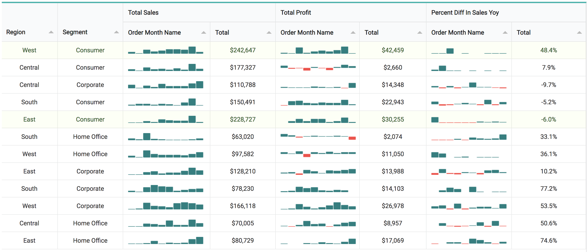

# tabulator-table

A lightly editable take on http://tabulator.info/ that is ready for use with Looker.

URL: https://s3.us-east-2.amazonaws.com/grood-lookin/table.js

Dependencies:
https://cdnjs.cloudflare.com/ajax/libs/tabulator/4.0.1/js/tabulator.min.js
https://code.jquery.com/jquery-3.1.1.min.js
https://cdnjs.cloudflare.com/ajax/libs/jquery-sparklines/2.1.2/jquery.sparkline.min.js×

For basic tables, the layout is similar to the standard table. Color, fonts and font size can be easily changed as well as basic conditional row formatting. You can format based on table calculations that are "hidden from the visualization" as well.

In the current version, pivots are swapped compared to the standard table:

You can also choose to convert your pivot to sparklines which can be a nice option for time related information:

      
